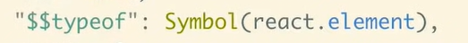

# Difference between class based and function based components. 
1. Class based components 
    1. In class based components whenever a state changes the component renders. But actually the state is mutated. That means a whole new state is not formed the previous state is mutated. If there is a state named a=5 then it is mutated to a=10. 

2. Function based components 
    1. Here a completely new component is formed and put in the tree. Hear the state does not changes button new state has prepared and brought in front of it. So here the state is not mutated it is completely changed. And therefore we can write caused keyword to declare to useState hook. 
    2. As a new component is created and put in front of it that means we have to take care of the event listeners and timers which we set in the previous state. If it is not cleared properly then that will remain in the component tree, therefore it becomes very necessary in the functional component to clear the timers and event listeners at the time of component unmounting. 

# Babel and Jsx 
    1. Babel is a transpiler which converts the jsx elements to the normal react.createElements and finally to the normal Vanilla JS objects. 
    2. So can we write the jsx and compiled. Yes we can write a j6 and can be compiled by using the babel. React components. 

# React Components 

    1. When we make a react component using the functional components we return a jSX from a functional component. That returning jsx is nothing but an object that object contains the properties of type, ref, props,key. Let's see we created a component named APP. APP is a functional component which is created in APP.js file. Now when we call it in our main file we just call it to by <APP /> . Here <APP /> will return of function and that function has object which is returned by APP functional component. 

# Reconcilation process Diffing Algorithm 
1. As we know that react creates a virtual Dom and first changes all the state in the virtual Dom and only the changes are reflected back to the real DOM. So if there would be no concept of the virtual Dom then each element rerendering will require n^3 of operations. That means for rendering n elements we required n^3 of time. Which would be very bad. 
2. So by using the react virtual Dom, the algorithm which is diffing algorithm is used to do this operations in n time. That means if n elements rerenders then it would require only n time. 
3. It is called as diffing algorithm because it is used to differentiate between the virtual Dom and the real Dom. 
4. Diffing algorithm works on two main assumptions 
    1.  two elements of Different types will produce different trees. 
    2. When we have a list of child elements which often changes we should provide and unique key as a prop. This means that it is very important to give a unique key because on this concept the whole react diffing algorithm is based now you should understand position.

5. 
When entire component type changesHere new tree is formed because of the first assumption . when the element changes entire tree is rerendered.
6. 
when the attributes of the componenet changes :- Here new tree will not be formed just the attribites will be changed and state will be maintained.

## changing childrens 
7. 
when the new children are added at the end react compares the above childrens and find that they are same so leave them as it is.then it checks the ending element which is newly added then react adds that new element in the tree.
8. 
if we added a new children in between the previously added childrens then the entire tree rerenders . in order to avoid it react uses the comcept of keys. 

here now we added the keys hence entire tree will not be rerendered. only that changed children  will be added to that component.

# React Prevents XSS attack

1. Symbol(react.createElement): In JavaScript, Symbol is a data type that represents a unique and immutable value. In this context, Symbol(react.createElement) is creating a unique symbol that is associated with React's createElement function. This symbol is used internally by React to identify React elements.

2. typeof: This is a property used internally by React to identify the type of an object. When you create a React element using React.createElement, React assigns a specific value to the $$typeof property for that element. This value is the unique symbol Symbol(react.createElement).

## So, why is this relevant to security?

1. React uses the $$typeof property to distinguish React elements from plain JavaScript objects. This can be helpful in preventing XSS attacks when rendering user-generated content in React components.

2. For example, if you were to render user-generated HTML content in a React component without proper sanitization, it could potentially lead to XSS vulnerabilities. However, React's use of the $$typeof property helps it recognize which objects are React elements and which are not. React elements are treated differently and undergo a process called "reconciliation," which ensures that the rendered content is safe by default.

3. In essence, React uses this mechanism to differentiate between trusted React elements and untrusted user-generated content. It doesn't prevent XSS attacks on its own, but it helps React identify what should be treated as potentially unsafe and what should be handled with caution.

4. To prevent XSS attacks, it's essential to follow best practices, such as sanitizing user input, using libraries like DOMPurify to sanitize HTML content, and understanding how React handles and renders user-generated data. The $$typeof property is just one piece of React's overall security strategy.

# React and React-Dom library.
1. React library is responsible for reconcialtion process and diffing algorithm.
2. react-dom is responsible for rendering process from virtual DOM to real DOM.
3. React Native does both the job by itself i.e diffing and rendering.
 